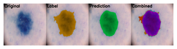
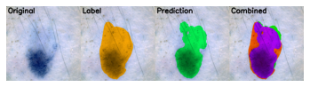
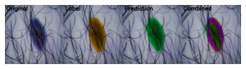
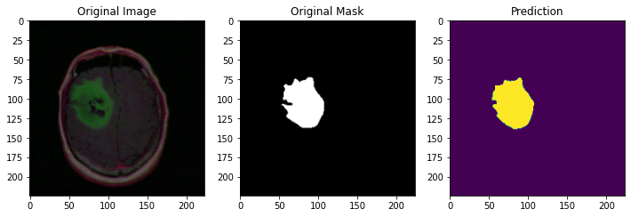
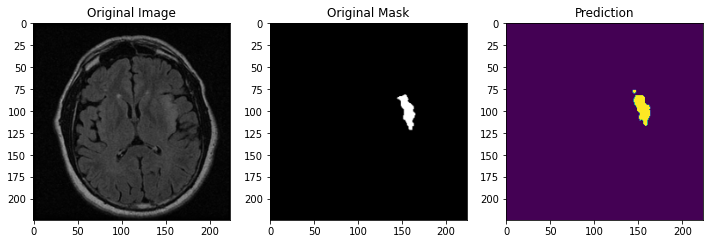
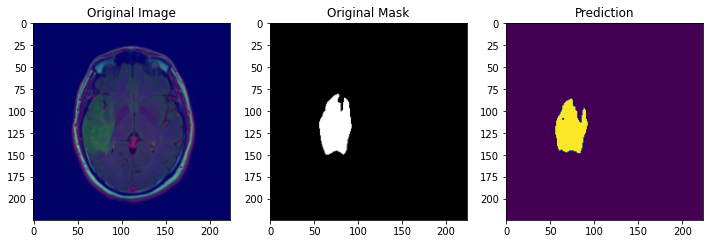
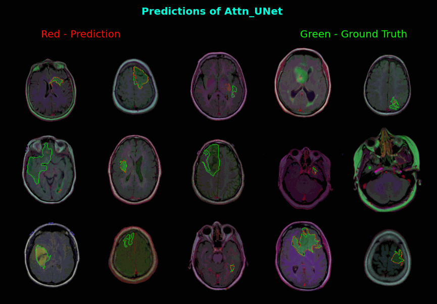

# Image Segmentation Model

## Installation
```
git clone https://github.com/quangdungluong/semantic-segmentation-model.git
cd semantic-segmentation-model
pip install -r requirements.txt
```

## Flask App demo
```
mkdir brain_mri/model_ckpt
# download the weight then move to brain_mri/model_ckpt directory
python app.py
```
- Weight: [Google Drive](https://drive.google.com/file/d/1FT-EAjxe3kKXd7pYeRyLePV-bvAeGftC/view?usp=sharing)


## Usage
```
from model import *
from trainer import *
from metrics import *
import torch

model = AttU_Net(img_ch=3, output_ch=1)
optimizer = torch.optim.Adam(model.parameters(), lr=0.0001)
scheduler = torch.optim.lr_scheduler.ReduceLROnPlateau(optimizer, 'max', patience=3, factor=0.5)
measures = {'dice_coef':dice_coef_metric,
           'iou':iou,
           'precision':precision,
           'recall':recall,
           'fscore':fscore}

train_log, val_log = train_model("R2UNet", model, dataloader, bce_dice_loss, optimizer, scheduler, measures, num_epochs)
```

# Dataset 1
[ISIC 2018 Challenge](https://challenge2018.isic-archive.com/task1/training/) Task 1: Lesion Boundary Segmentation

The dataset (training and validation) was split into three subsets, training set, validation set, and test set (included original validation set), which the proportion is 80%, 10% and 10% of the whole dataset, respectively. The entire dataset contains 2694 images where 2075 images were used for training, 259 for validation and 360 for testing models.

## Result

|   Method          | ResNeXt50-UNet    |   Attention UNet  |
| :---              | :---:             | :---:             |
| Dice coefficient  | 0.901             | 0.850             |
| IoU               | 0.822             | 0.743             |
| Precision         | 0.894             | 0.865             |
| Recall            | 0.913             | 0.841             |
| F1-Score          | 0.901             | 0.850             |


In the combined image:
- **Purple**: True Positive (model prediction matches lesion area marked by human)
- **Blue**: False Negative (model missed part of lesion in the area)
- **Green**: False Positive (model incorrectly predicted lesion in an area where there is none)








# Dataset 2
[Brain MRI Segmentation](https://www.kaggle.com/datasets/mateuszbuda/lgg-mri-segmentation) LGG Segmentation Dataset
* This dataset contains brain MR images together with manual FLAIR abnormality segmentation masks.
* The images were obtained from The Cancer Imaging Archive (TCIA).
* They correspond to 110 patients included in The Cancer Genome Atlas (TCGA) lower-grade glioma collection with at least fluid-attenuated inversion recovery (FLAIR) sequence and genomic cluster data available.

## Result on test set

|   Method          | UNet              | ResNeXt50-UNet    | Attention UNet    |
| :---              | :---:             | :---:             | :---:             |
| Dice coefficient  | 0.848             | 0.819             | 0.877             |
| IoU               | 0.742             | 0.737             | 0.788             |
| Precision         | 0.852             | 0.801             | 0.872             |
| Recall            | 0.850             | 0.816             | 0.892             |
| F1-Score          | 0.847             | 0.793             | 0.877             |










## The project is still in progress...